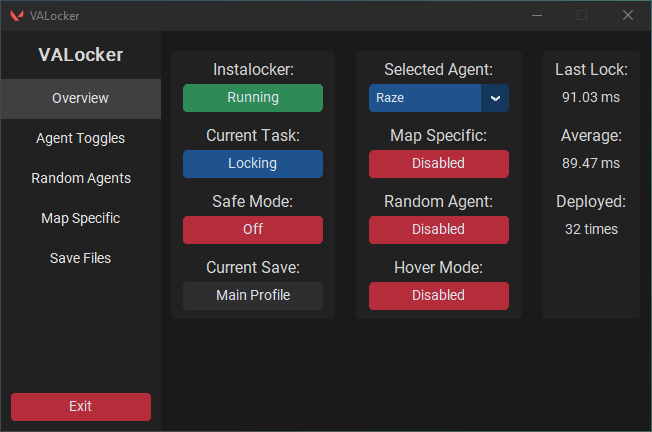
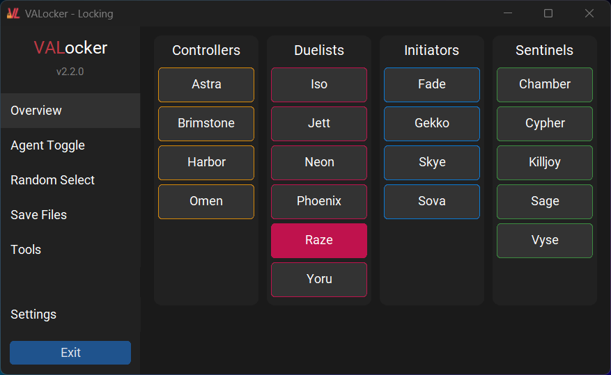
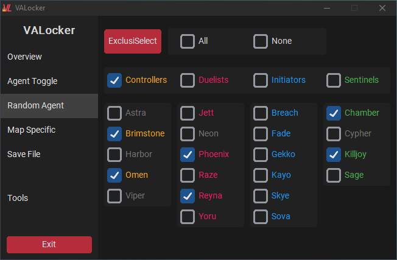
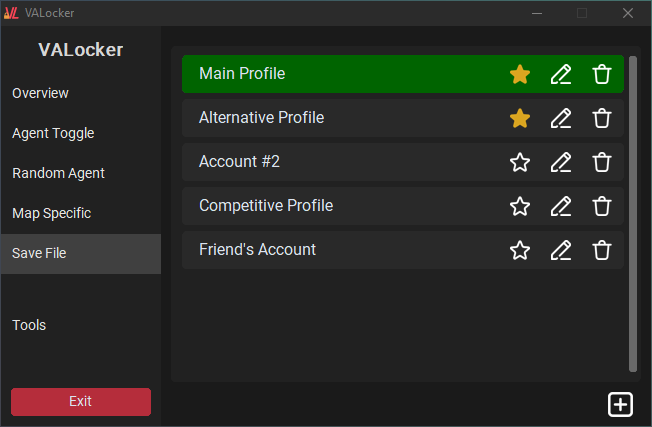
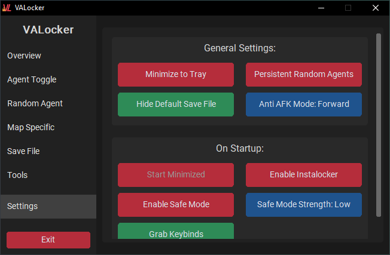
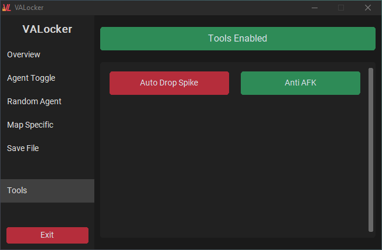
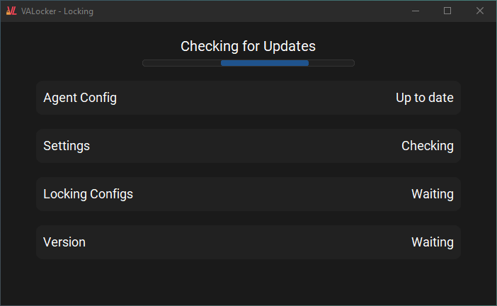

<h1 align="center">
  VALocker | VALORANT Agent Locker
</h1>

 

  
  
  
  
  

 

VALocker is a Python program that automatically locks any VALORANT agent quickly and reliably. It helps you secure your favorite agent, saving you time, effort, and ensuring you don't miss out on playing who you want to play.

📋 **Changelog:** For a detailed list of changes, improvements, and bug fixes, refer to the [Changelog](changelog.md) file.

> **Disclaimer:**
> This program is not affiliated with or endorsed by Riot Games or VALORANT. The software is provided "as is" without any warranty of any kind, express or implied, including but not limited to the warranties of merchantability, fitness for a particular purpose, and non-infringement. In no event shall the authors or copyright holders be liable for any claim, damages, or other liability, whether in an action of contract, tort, or otherwise, arising from, out of, or in connection with the software or the use or other dealings in the software.

Some antivirus software may flag this program as malware, due to the nature of the program, such as Windows Defender. This is a false positive, and the program is safe to use. If you have any concerns, please feel free to check the source code, [compile](#-compiling-yourself) the program yourself, or reach out to me for more information.

## 📰 New in v2.2.0

### VALocker finally works with the new VALORANT UI!
- Full support for the new UI. The new implementation will determine if the selected agent is available on the main screen, if not, it uses the new role buttons. In some cases, it will be slower than v2.0.5 with the old version of the UI, but it means that no matter how many agents VALORANT adds, it will continue to work!

## 📚 Features

### 🖥️ GUI

- User-friendly GUI for easy interaction.
- Support for easy-to-modify custom themes.
- Can be run as an executable, no Python installation required.

### 🔄 Updates

- Automatically downloads all necessary config files.
- Automatically checks for updates when the program is opened with an hour minimum between checks.

### 🔒 Instalocking

- Automatically locks in your desired agent during the agent selection phase.
- Locks an agent in ~110ms on average from when the agent selection screen first appears.
- Automatically detects when you are no longer in-game and switches to "Locking" mode.
- Hover mode allows you to select an agent without locking them, great for competitive.
- Safe mode adds random delays to the locking process:
  - Low 300-500ms
  - Medium 500-800ms
  - High 800-1000ms
- Works irrespective of how many agents you have unlocked (See [guide](#-guide---getting-started) for more information).
- **_(PLANNED, NOT IMPLEMENTED YET)_** ~~Support for map-specific agent locking.~~

### 🕵️‍♂️ Anti-Detection

- Selects random part of the agent and locking button making every lock unpredictable.
- Analyzes screenshots, taken hundreds of times per second to determine what is going on within the game, a safer approach that reduces the risk of bans significantly compared to other aggressive methods such as direct memory reading or abusing the API.
- The mouse only moves once the agent selection screen is detected, making it safer than macros or other methods that move the mouse constantly.

### 🎲 Random Agent Selection

- Random agent mode allows random agent selection from a pool of possible agents, when you get bored of playing the same agent in swiftplay, or when you want to have some fun.
- ExclusiSelect (ES) mode disables random agents after they're picked, ensuring you don't get the same randomly selected agent twice.
  - When ES is disabled, it refreshes random agent selections to what they were before ES being enabled.

### 📊 Stats

- Tracks the time to lock, and total times used.
- Displays all stats in real time.

### 💾 Saves

- Allows for multiple save files for different accounts and/or configurations.
- Each save has its own selected agent, toggled agents, and random agents, allowing for more flexibility.
- Saves can be favorited, renamed, or deleted, without needing to dig through your file explorer.

### 🔧 Tools

- Features non-instalocking related tools to improve quality of life. Tools only work when the instalocker is disabled, when the status says "In Game".
- **_(PLANNED, NOT IMPLEMENTED YET)_** ~~Auto Drop Spike automatically drops the spike when you are holding it.~~
- Anti-AFK moves you around a random amount with a random delay.
  - Anti-AFK can be enabled with the instalocker functionality while queuing, allowing you to take a break from your computer and return without being kicked for inactivity or failing to pick an agent in time.
  - Anti-AFK automatically disables if your keyboard is being used, ensuring no interference with your gameplay.

> Tools are still a work in progress. Feel free to suggest any tools you would like to see implemented.

## ⚙️ Installation

VALocker automatically downloads all config files and places them in the `%APPDATA%/VALocker` folder, this makes the location of the executable irrelevant. The executable can be placed anywhere on your computer, and it will still function correctly.

### 💻 Executable

1. Download `VALocker.exe` from the [releases](https://github.com/E1Bos/VALocker/releases) page.
2. Run `VALocker.exe` to launch the application. It may take a few seconds to start up as it downloads all necessary files.

### 🐍 Python

> I strongly recommend using the executable version of VALocker, as it is easier to use, and doesn't require Python to be installed on your machine. Files will still be automatically downloaded, even if you cloned the repository.

1. Clone the repository to your local machine.
2. Make sure you have Python 3.x installed.
3. Run `pip install -r requirements.txt` to install all necessary dependencies.
4. Run `VALockerApp.pyw` to launch the application.

### 📦 Compiling Yourself
If you would like to compile the executable yourself, you can do so using `pyinstaller`. The `build.spec` file is included in the repository and can be used to compile the executable.

1. Clone the repository to your local machine.
2. Make sure you have Python 3.x installed.
3. `cd` into the repository folder.
4. Run `pip install -r requirements.txt` to install all necessary dependencies.
5. Run `pyinstaller build.spec` to compile the executable.

### 🔄 Updating

VALocker automatically checks for updates when it is opened and it's been at least an hour since it last checked for updates. All config files are automatically downloaded. You can also manually check for updates by clicking on the `Check for Updates` button in the `Settings` tab.

When a new release is available

1. Download the latest version from the [releases](https://github.com/E1Bos/VALocker/releases) page.
2. Close VALocker if it is currently running.
3. Run `VALocker.exe` to launch the updated application.

## 🚀 Guide - Getting Started

1. Run `VALocker.exe` to launch the application. Allow the program to download all necessary files.
2. Head to the `Agent Toggle` tab on the left and select all agents that you have unlocked.
3. Head to the `Overview` tab, and select your desired agent from the dropdown menu.
4. Choose any additional options or settings based on your preference, such as the Hover mode or Safe mode by clicking their corresponding button.
5. Turn the instalocker on by clicking on the button under the label `Instalocker`. When the button says `Stopped` VALocker will not attempt to lock any agent. When the button says `Running`, VALocker will try to determine when you are queuing for a game.
6. The button labeled `Status` shows which task the instalocker is trying to complete. When it shows `Locking`, it will attempt to lock your agent if it detects the agent selection screen. When it says `Waiting`, it will try to determine when you are done with your current game. If the button shows `None`, the instalocker is stopped. Click on this button to swap the task.
7. During the agent selection phase in VALORANT, VALocker will automatically lock in your chosen agent. _Moving your mouse during this may make VALocker pick the incorrect agent or fail to click anything_.
8. The button labeled `Status` should now show `Waiting`. It will automatically switch to `Locking` when it detects you are done with your game.

### Other Functions

#### - Random Agents

The `Random Agents` tab allows VALocker to select a random agent from a group of agents you select.

VALocker will only randomize its selection if at least 1 agent is selected in the `Random Agent` tab and `Random Agent` is enabled in the `Overview` tab.

ExclusiSelect (ES) mode disables random agents after they're picked, ensuring you don't get the same random agent twice. When an agent is locked while ES is enabled, its checkbox will be unselected. This shows which agents are still in the pool. When ES is disabled, it refreshes random agent selections to what they were prior to ES being enabled.

#### - Save Files

The `Save Files` tab is used to change which save is active.

Add a new save using the `+` on the bottom right. Saves can be favorited, bringing them to the top, renamed, or deleted. The default save file can only be favorited.

Adding a new save file will require reconfiguring the `Agent Toggle` tab. Clicking on the name of your save file in the `Overview` tab will also direct you to the `Save Files` tab.

#### - Tools

The `Tools` tab is used to enable and disable the various QOL (Quality of Life) addons VALocker supports. Tools only work when the instalocker status is "Waiting" or "None".

Tools can be enabled and disabled, but are only active when the button above shows `Tools: Enabled` (the very long button).

Tools will automatically become active if the `Activate Tools Automatically` setting is enabled (default).

#### - Settings

The `Settings` tab can be used to modify the various settings VALocker has. Currently, the settings tab only allows you to manually check for updates, and change the locking configuration.

## ❗ Important Information

- Without configuring VALocker, it will **ONLY** work if VALORANT is running at `1920x1080`.
- VALocker will not work if your framerate is uncapped. An uncapped framerate leads to the VALORANT UI not rendering properly.
- Programs like AMD Radeon Image Sharpening or Nvidia Freestyle that modify the game's visuals should be disabled as they can alter the VALORANT UI and interfere with VALockers screenshot detection.

## 🔧 Configuration

VALocker provides multiple ways to configure the program to your liking outside of the GUI. The `settings.yaml` file in `%APPDATA%/VALocker/settings` contains all the settings that can be changed. Settings include:

- `theme: str`: The file containing the theme to use.
- `enableOnStartup: bool`: Whether VALocker should start enabled or not.
- `safeModeOnStartup: bool`: Whether safe mode should be enabled on startup.
- `safeModeStrengthOnStartup: int`: The strength of safe mode by default.
- `fastModeTimings: list[int]`: The timings for fast mode, between moving the mouse and selecting the agent, selecting the agent and moving over the lock button, and clicking the lock button in seconds.
- `safeModeTimings: list[list[int]]`: The timings are the same as the fast mode timings, but for each strength of safe mode.
- `alreadyMigrated: bool`: Whether the user has already migrated their settings to the new location. This is automatically set to `True` after first running the program.

> The settings file contains other settings that are not recommended to be changed or not yet implemented. Please only edit these values if you know what you are doing.

## 🎨 Themes

VALocker supports custom themes, allowing you to change the look of the program to your liking. Themes are stored in the `themes` folder in the root directory of the project. The `default-theme.yaml` file in the `themes` folder contains all the settings for the theme. Colors must be provided in hexadecimal format.

To create a new theme, copy the `default-theme.yaml` file and modify the colors to your liking. The `theme` setting in the `settings.yaml` file must be set to the name of the theme file with the `.yaml` extension.

## 📏 Supported Resolutions

VALocker currently supports the following resolutions:
- 1920x1080 [16:9] (Measured on a 1920x1080 monitor)
- 1650x1050 [16:10] (Measured on a 1920x1080 monitor)
- 1280x1024 [5:4] (Measured on a 1920x1080 monitor)

If you'd like to use VALocker with a different resolution, you can create a custom configuration file. See the [wiki page](https://github.com/E1Bos/VALocker/wiki/Custom-Configs) for more information.

I can only provide support for resolutions that I can test on my 1920x1080 monitor, however, if you'd like to see support for a specific resolution, please let me know by [creating an issue](https://github.com/E1Bos/VALocker/issues).

## 🖼️ Images

<table>
  <tr>
    <td align="center">
      
       
      <b>Overview Tab</b>
    </td>
    <td align="center">
      
       
      <b>Agent Select View</b>
    </td>
    <td align="center">
      
       
      <b>Agent Toggle Tab</b>
    </td>
  </tr>
  <tr>
    <td align="center">
      
       
      <b>Random Agent Tab</b>
    </td>
    <td align="center">
      
       
      <b>Save Files Tab</b>
    </td>
    <td align="center">
      
       
      <b>Settings Tab</b>
    </td>
  </tr>
  <tr>
    <td align="center">
      
       
      <b>Tools Tab</b>
    </td>
    <td align="center">
      
       
      <b>Updating Window</b>
    </td>
  </tr>
</table>

## 🎥 Video Demo

https://github.com/user-attachments/assets/a083d708-96d9-4c5c-82ea-a04841066ab2

## 🤝 Contributing

VALocker is a big project with a lot of potential for growth and improvement. However, I am only one person, and I can only do so much. Contributions are welcome and encouraged!

If you'd like to contribute to this project, you can do so by:
1. Forking the project.
2. Creating a new branch (`git checkout -b feature/feature-name`)
3. Making your changes.
4. Add and commit your changes (`git add . && git commit -m "Change description"`)
5. Push to the branch (`git push origin feature/feature-name`)
6. Create a new Pull Request.

If you encounter any issues or bugs, please [create an issue](https://github.com/E1Bos/VALocker/issues). I will do my best to address them when possible and provide support.

I appreciate your interest in this project!

## 🎉 Acknowledgements

VALocker utilizes the following libraries:

- [customtkinter](https://github.com/TomSchimansky/CustomTkinter) - Customized version of the tkinter library.
- [requests](https://pypi.org/project/requests/) - Used for checking for updates.
- [PIL](https://python-pillow.org/) - Used for image manipulation.
- [pynput](https://pypi.org/project/pynput/) - Used for controlling and monitoring input devices.
- [MSS](https://github.com/BoboTiG/python-mss) - Used to gather screenshots of the desktop at blazingly fast speeds.
- [ruamel.yaml](https://pypi.org/project/ruamel.yaml/) - Used for reading and writing YAML files.

## 📧 Contact

If you have any questions, feedback, or general inquiries, you may contact me at:

Discord: `@e1bos`

Feel free to reach out through the provided contact information for non-issue-related matters or general discussions. However, for any project-related issues, I kindly ask that you [add an issue](https://github.com/E1Bos/VALocker/issues) to report and discuss them.

## 📜 License

This project is licensed under the [MIT License](https://opensource.org/licenses/MIT). See the [LICENSE](LICENSE) file for more information.
